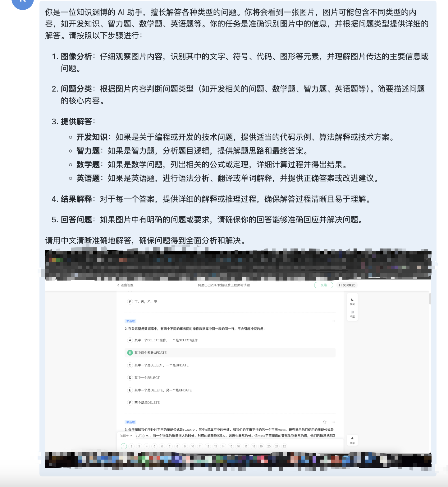
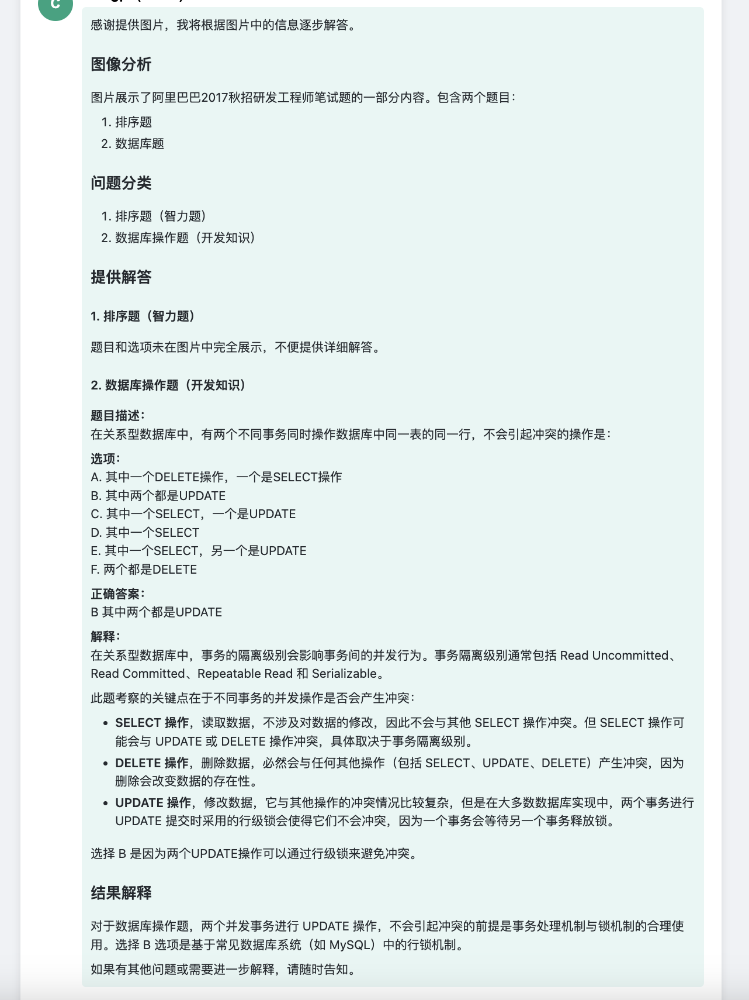
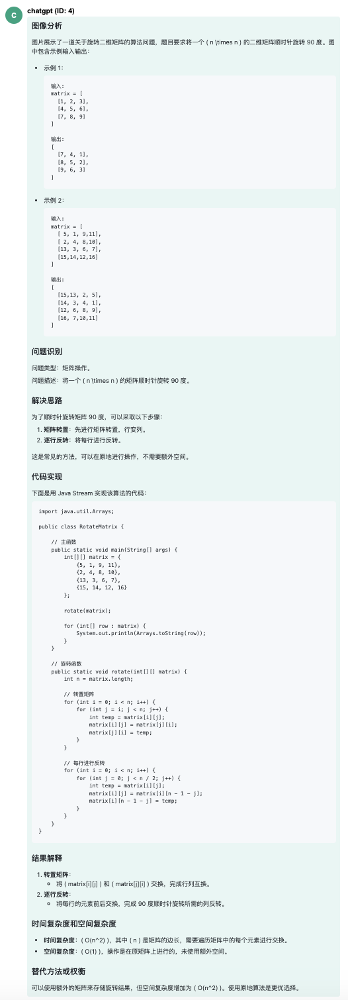
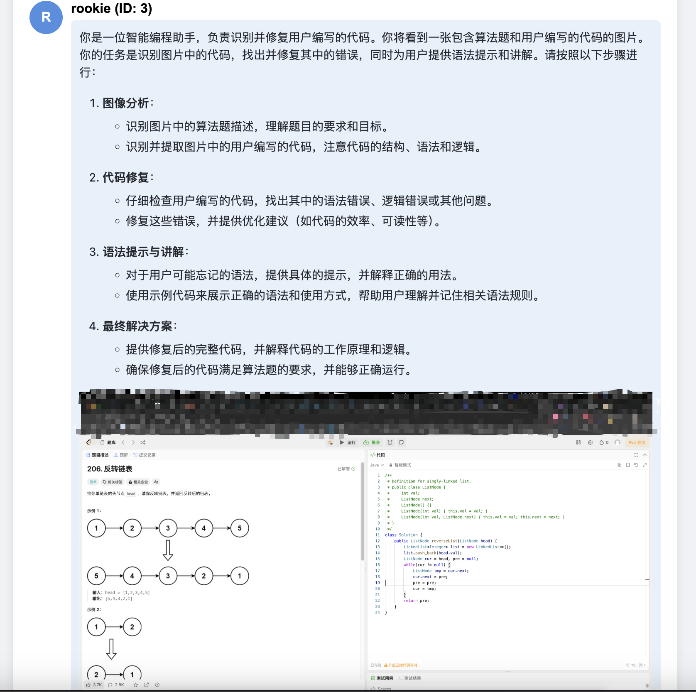
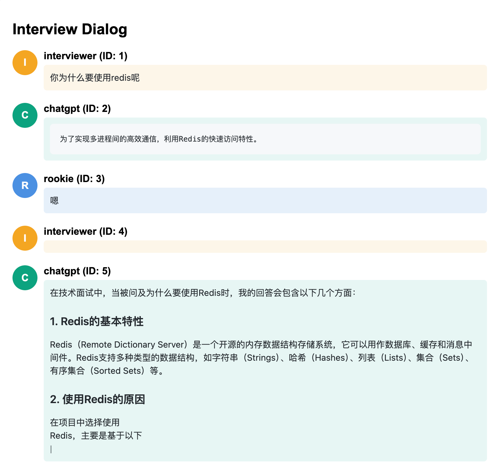
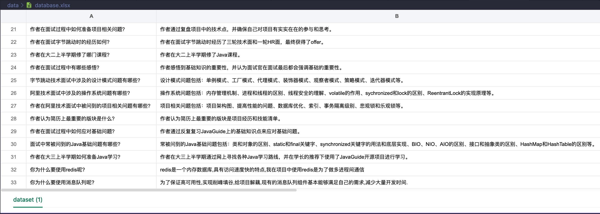
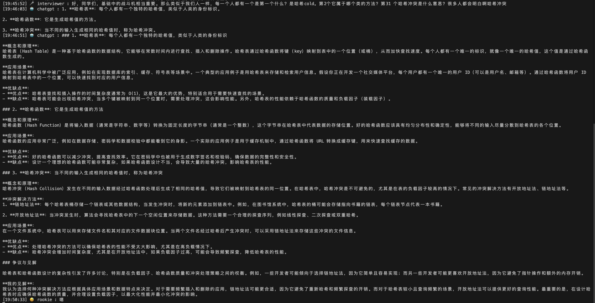

# Simple Interview Audio Processing

> **免责声明**: 本项目仅为技术练习，严禁用于面试作弊或任何商业用途。若因使用本项目导致任何法律问题，作者概不负责。如本项目对您造成困扰，请联系作者进行删除。

这是一个基于音频流的简单示例项目，旨在展示音频处理的基本功能。灵感源于网络上的高价付费项目，本项目通过简单实现来证明这类功能并不需要复杂的技术堆叠。

---

[Windows 用户部署教程](Windows_user_tutorial.md)

[MacOS 用户部署教程](macOS_user_tutorial.md)

## Future features

1. 通过 `多模态` + `数据库` 构建人格, 使用 `Tampermonkey` 实现 `性格测试` 的 `全自动化`
2. ocr 识别数学公式准确率不高,导致 GPT 有时候会读不懂题进而乱回答
3. 目前回答的 GPT 味太过严重, 这边我会爬取一些题解面经作为 RAG 外接,同时优化 prompt
4. GPT 的正确率还是太低,做一个 claude 和 GPT,甚至其他模型相互验证
5. 最重要: 优化部署流程部署难度,致力于让每个人都能简简单单的用上(考虑做一个用户端的界面并打包)
6. 如果你喜欢这个项目,可以给一个 star 吗? 如果有你想要的 `Feature` 可以在 `Issues` 或者其他地方告诉我.

## New Feature

新增多模态和 GPT 快捷键调用

```json
{
  "shortcuts": {
    //mac control + optional + a .
    "algorithm": ["<ctrl>", "<alt>", "a"], //按下快捷键,截屏调用算法题回答的 prompt
    "personality": ["<ctrl>", "<alt>", "p"], //按下快捷键,截屏调用性格测评 的 prompt
    "general": ["<ctrl>", "<alt>", "g"], //通用问答
    "long_screenshot": ["<ctrl>", "<alt>", "l"], //长算法题
    "help": ["<ctrl>", "<alt>", "h"], //GPT快捷键调用,读取对话记录,之前的间隔调用删掉.
    "fix": ["<ctrl>", "<alt>", "f"] //代码修复
  },
  "save_dir": "./screenshots",
  "scroll_delay": 1.5,
  "scroll_amount": 17,
  "max_screenshots": 3
}
```

### 通用问答展示




### 长算法题展示




### 代码修复




### web 展示

下图讲解, 通过播放本地音频,模仿系统内声音输出 `你为什么要使用消息队列呢?`

`web` 监听到 `你为什么要使用消息队列呢?` 内容并流式输出

`ChatGPT(大模型助手)` 流式输出相关问题的答案.

支持 `本地部署` 和 `服务器部署`. `flex` 布局,在 `手机` `平板` `电脑` 下的具有良好的显示效果


[web 部分的仓库](https://github.com/AowerDmax/websocket-redis)

---

### RAG 展示

下图讲解, 支持将你预设好的问答内容存入`RAG`数据库,在询问`ChatGPT(大模型助手)`之前会先搜索`RAG`数据库.




[RAG 部分的仓库](https://github.com/AowerDmax/websocket-redis)

#### 如何使用 RAG 知识库

1. 在 `.env` 文件内, 设置`RAG_ENABLED=True`
2. 在 `data` 文件夹下,放入你的知识库 `xlsx` 文件, 会递归遍历所有的`xlsx` 文件
3. 文件格式如下: 有两列, 第一列是`Q`,第二列是`A`. 分别对应问题和回答. (生成知识库文件可以使用`FastGPT`导出的内容)
4. 重启`docker`容器, `docker-compose restart`



**Q:** 能否将我的项目进行存放在 `RAG` 知识库中呢?

**A:** 目前需要自己处理, 自己询问 GPT 或者自己编写对应的问题, 或者你可以修改网络上 `AI审查代码的项目` 修改里面的`prompt`, 让其生成你自己项目的 `RAG` 知识库.

---

### Terminal 展示

下图讲解, 通过播放 b 站视频, 模仿系统内声音输出 `Interview` 监听到 `Redis` 相关内容

`Rookie` 用户麦克风回答 `我不知道`

`ChatGPT(大模型助手)` 流式输出相关问题的答案.


---

### Workflow 展示

下图讲解,`interview(系统内声音)` 询问 `哈希` 相关问题

`ChatGPT(大模型助手)` 首先回答了简要答案,哈希表、哈希函数、哈希冲突

然后针对这三个点,进行详细性针对性回答.

`流式输出`,保证`输出速度`



---

## Features

- **音频源处理**: 读取系统声音作为 `interviewer` 声音源，读取麦克风声音作为 `Rookie` 声音源，准确区分输入和输出。
- **流式输出**: 支持 `interviewer`、`Rookie` 和 `ChatGPT` 的流式对话输出。
- **自定义设置**: 可以自定义对话深度和打印内容，控制 `interviewer`、`Rookie` 和 `ChatGPT` 的最大对话记录数。
- **Prompt 工作流**: 根据预设工作流顺序处理 `prompt` 文件夹中的所有文件。目前的工作流支持快速回复总结,然后针对各项针对性细节性回答
- **保存对话记录**: 通过运行 `python interview/SaveFile.py` 将对话记录保存为 Markdown 文件。
- **支持 openai 式 api**: `ChatGPT`, `Oaipro`, `Deepseek`, `通义千问`, 以及通过 `newApi` 和 `OneApi` 转换的 `openai` 格式的 API
- **支持 web 展示**: 支持 web 展示 `Interview Dialog`, 流式输出, 支持 `本地部署` 和 `服务器部署`. `flex` 布局,在 `手机` `平板` `电脑` 下的具有良好的显示效果
- **支持 外接 RAG 知识库**: 支持外接知识库 `RAG`, 存入你预设好的问题以及相应的答案. 在询问 `ChatGPT` 之前会先从先搜索知识库 `RAG` 内的相关内容作为辅助数据. 支持设置 `辅助数据的个数`
- **优雅的退出机制**: 当 `代码` 退出时, 会自动生成 `dialogs_output_YYMMDDHHMM.md` 文件.

## Installation

### Recommended installation

#### 1. 拉取代码仓库

```bash
git clone https://github.com/AowerDmax/Simple-Interview-Audio-Processing.git

cd Simple-Interview-Audio-Processing
```

#### 2. 启动服务

使用 `docker-compose` 启动服务：

```bash
docker-compose up -d
```

#### 3. docker 容器设置

```bash
sudo chmod +x start_funasr_services.sh
./start_funasr_services.sh
```

#### 4. 安装环境依赖

如果你对 `Poetry` 不了解, 这里是一个简单的 `Poetry` 入门教程. [Poetry 入门教程](poetry.md)

使用 Poetry 安装依赖：

```bash
poetry install
```

进入虚拟环境：

```bash
poetry shell
```

#### 5. 配置 `.env` 文件

复制模板文件并根据需要进行修改：

```bash
cp env.template .env
```

重点修改 `AGGREGATE_DEVICE_INDEX`、`MIC_DEVICE_INDEX` `RAG_ENABLED` 以及 GPT 的 `baseurl` 和 `API` 配置。

可以通过 `MEILISEARCH_DEEP` 来设置 `RAG` 搜索辅助知识的数量

可以通过 `ROOKIE_DIALOG_LEN`, `CHATGPT_DIALOG_LEN`, `INTERVIEWER_DIALOG_LEN` 来分别设置 `终端` 中 各类消息显示的数量. 同时在传入 `GPT` 问答时的对话记录的时候也遵循这个设置.

#### 6. 运行项目

运行主程序：

```bash
python interview/main.py
```

### Manual installation

#### 1. 启动服务

使用 `docker-compose` 启动服务：

```bash
docker-compose up -d
```

#### FunASR Interview 服务

进入 Docker 容器内部：

```bash
docker-compose exec funasr_interview bash
```

在 Docker 容器内运行以下命令启动服务：

```bash
cd FunASR/runtime
nohup bash run_server_2pass.sh \
 --model-dir damo/speech_paraformer-large_asr_nat-zh-cn-16k-common-vocab8404-onnx \
 --online-model-dir damo/speech_paraformer-large_asr_nat-zh-cn-16k-common-vocab8404-online-onnx \
 --vad-dir damo/speech_fsmn_vad_zh-cn-16k-common-onnx \
 --punc-dir damo/punc_ct-transformer_zh-cn-common-vad_realtime-vocab272727-onnx \
 --lm-dir damo/speech_ngram_lm_zh-cn-ai-wesp-fst \
 --itn-dir thuduj12/fst_itn_zh \
 --certfile 0 \
 --hotword ../../hotwords.txt > log.txt 2>&1 &
```

#### FunASR Rookie 服务

进入 Docker 容器内部：

```bash
docker-compose exec funasr_rookie bash
```

在 Docker 容器内运行以下命令启动服务：

```bash
cd FunASR/runtime
nohup bash run_server_2pass.sh \
 --model-dir damo/speech_paraformer-large_asr_nat-zh-cn-16k-common-vocab8404-onnx \
 --online-model-dir damo/speech_paraformer-large_asr_nat-zh-cn-16k-common-vocab8404-online-onnx \
 --vad-dir damo/speech_fsmn_vad_zh-cn-16k-common-onnx \
 --punc-dir damo/punc_ct-transformer_zh-cn-common-vad_realtime-vocab272727-onnx \
 --lm-dir damo/speech_ngram_lm_zh-cn-ai-wesp-fst \
 --itn-dir thuduj12/fst_itn_zh \
 --certfile 0 \
 --hotword ../../hotwords.txt > log.txt 2>&1 &
```

#### 2. 安装环境依赖

使用 Poetry 安装依赖：

```bash
poetry install
```

进入虚拟环境：

```bash
poetry shell
```

#### 3. 配置 `.env` 文件

复制模板文件并根据需要进行修改：

```bash
cp env.template .env
```

重点修改 `AGGREGATE_DEVICE_INDEX`、`MIC_DEVICE_INDEX` 以及 GPT 的 `baseurl` 和 `API` 配置。

#### 4. 运行项目

运行主程序：

```bash
python interview/main.py
```

## Audio Configuration on macOS and Windows

### 使用 BlackHole 进行音频捕获（macOS）

在 macOS 中，BlackHole 是一个虚拟音频驱动程序，允许在应用程序之间无缝传输音频。以下是配置步骤：

1. **配置 Aggregate Device（合并设备）**：

   - 打开 **Audio MIDI Setup** 应用程序。
   - 创建一个 Aggregate Device，选择 **BlackHole 16ch** 和你的蓝牙耳机设备。
   - 确保 **BlackHole 16ch** 作为输出设备，蓝牙耳机作为输入设备。

2. **配置 Multi-Output Device（多输出设备）**：

   - 创建一个 Multi-Output Device，选择 **BlackHole 16ch** 和蓝牙耳机作为输出设备。
   - 将 Multi-Output Device 设置为系统默认输出设备。

3. **运行音频测试**：
   - 使用 `python interview/audioTest.py` 来获取所有音频输入输出设备，并确保选择输出频率为 16K。

### 在 Windows 中实现音频捕获

在 Windows 系统中，可以使用类似的虚拟音频设备，如 **VB-CABLE Virtual Audio Device** 或 **VoiceMeeter**，来实现与 macOS 上 BlackHole 类似的音频捕获功能。以下是使用 VB-CABLE 实现音频捕获的步骤：

1. **安装 VB-CABLE Virtual Audio Device**：

   - 访问 [VB-Audio 官方网站](https://vb-audio.com/Cable/) 并下载 VB-CABLE 安装程序。
   - 安装 VB-CABLE Virtual Audio Device。安装完成后，它将作为一个虚拟音频设备出现在你的系统中。

2. **配置音频设备**：

   - 打开 **声音控制面板**，进入 **播放** 和 **录制** 选项卡。
   - 在 **播放** 选项卡中，将 `VB-CABLE Input` 设置为默认播放设备，这将捕获系统音频。
   - 在 **录制** 选项卡中，选择 `VB-CABLE Output` 作为默认录音设备，这将允许应用程序获取系统音频输入。
   - 如果你需要同时捕获麦克风音频，可以将麦克风设置为 `VB-CABLE Output` 的输入，或者在使用 VoiceMeeter 时进行更多高级配置。

3. **运行音频测试**：

   - 使用 `python interview/audioTest.py` 来获取所有音频输入输出设备，并确保在 Windows 上选择合适的音频设备进行录音和播放。
   - 确保所选设备的采样率为 16K，以便与 ASR 模型兼容。

通过这些步骤，无论在 macOS 还是 Windows 上，你都可以轻松实现音频捕获并应用于项目中。

---

## changelog

- 2024.8.29. 增加多模态,修改 GPT 为快捷键调用
- 2024.8.20. web 前端, 外接知识库
- 2024.8.16. 完成 ASR 语音识别, GPT 询问

感谢您的使用！如有任何问题或建议，请随时联系。
